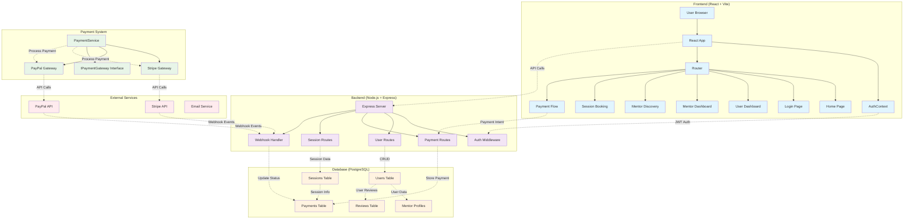
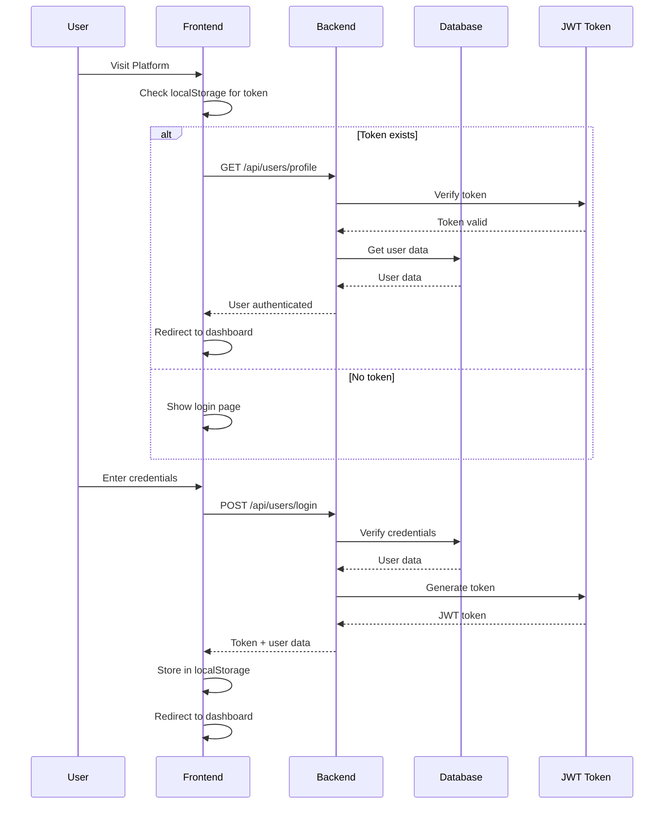
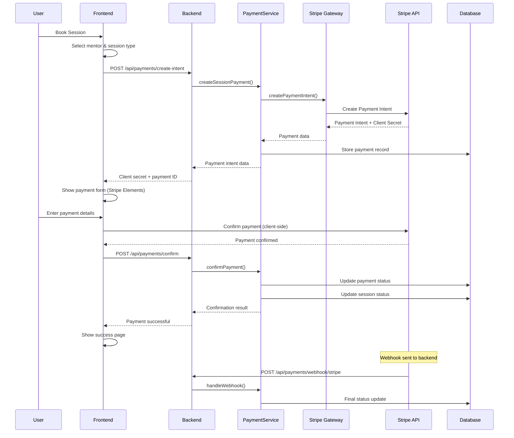
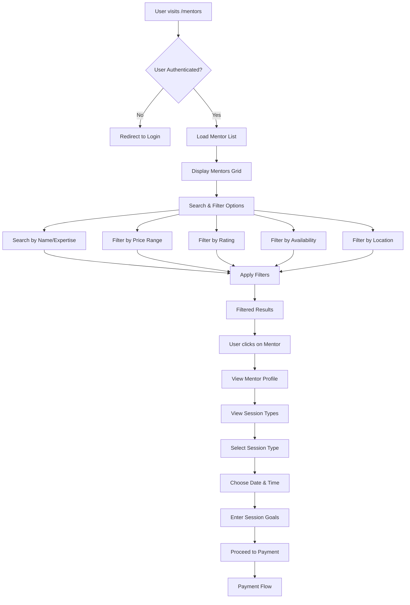
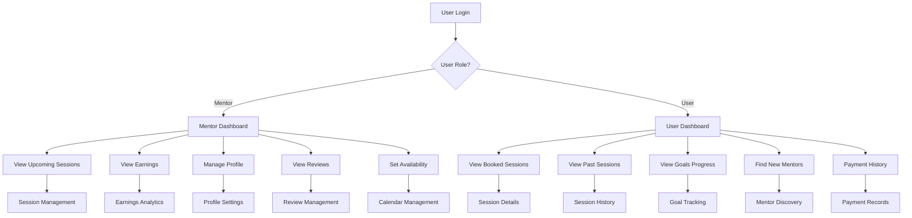
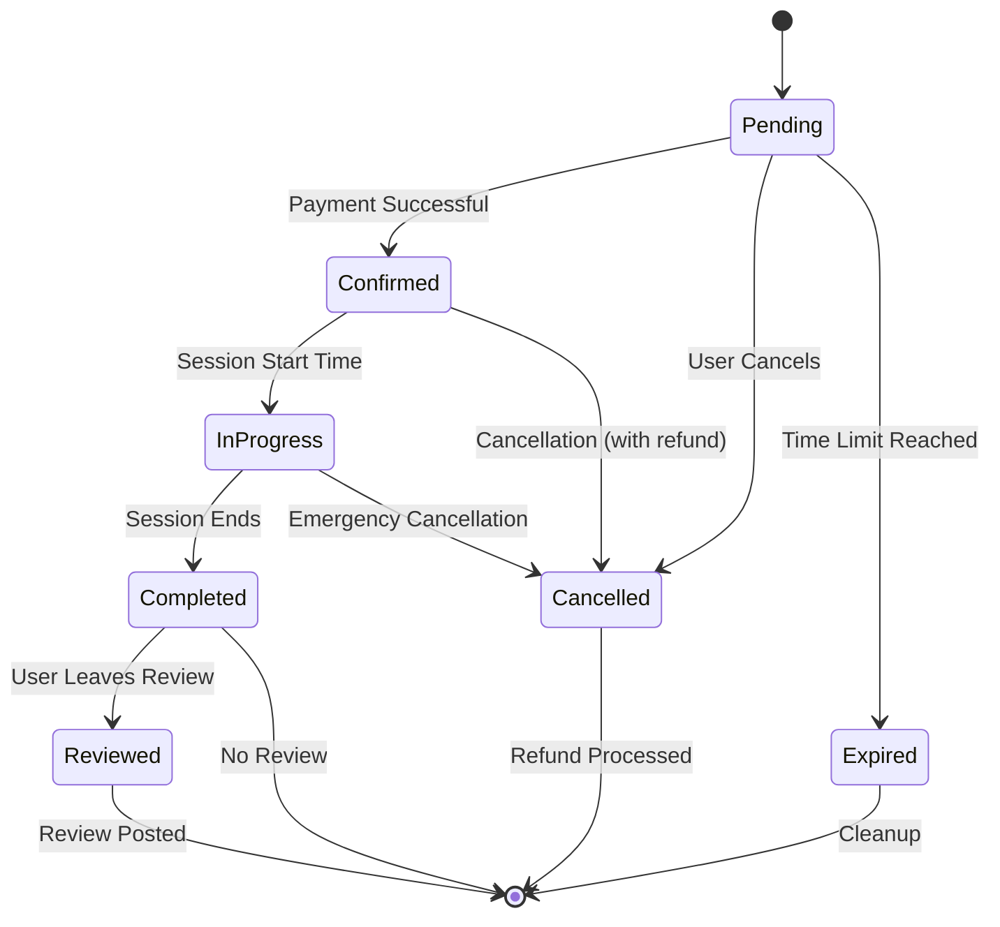
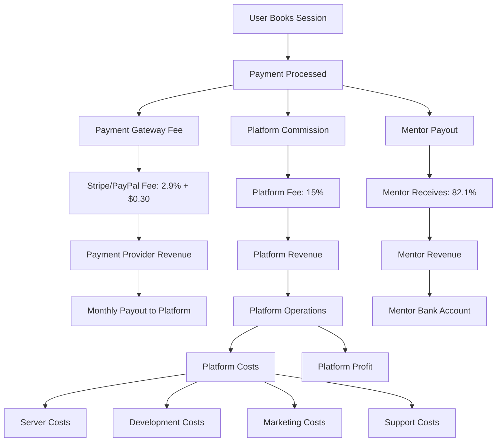
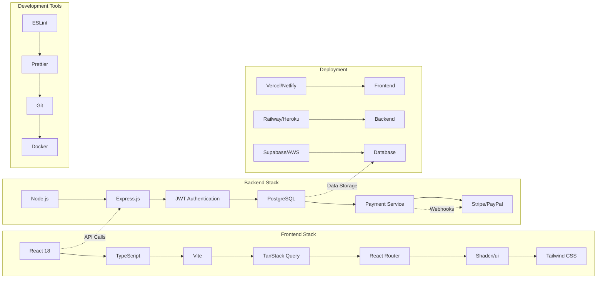
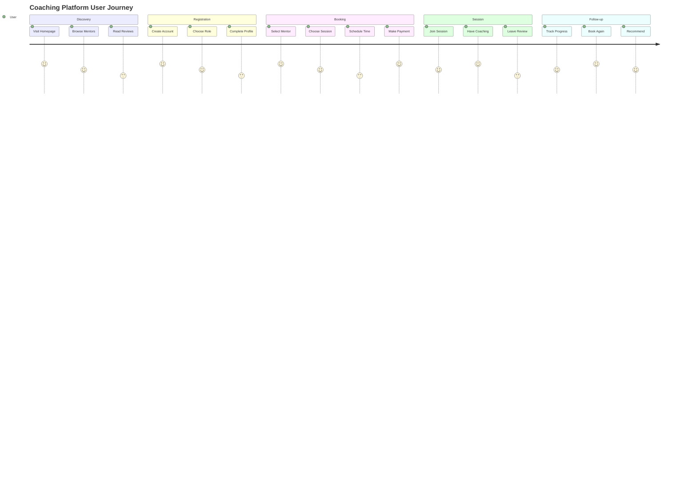

# 🔄 Coaching Platform Flow Diagram

## 🏗️ **System Architecture Overview**

## 🔐 **Authentication Flow**

## 💳 **Payment Flow**

## 🔍 **Mentor Discovery Flow**

## 📊 **Dashboard Flow**

## 🔄 **Session Lifecycle**

## 💰 **Revenue Flow**

## 🔧 **Technical Stack Flow**

## 🎯 **User Journey Flow**

---

## 📋 **Current Implementation Status**

### ✅ **Completed Features:**
- **Authentication System** (JWT, Role-based access)
- **Payment Gateway Abstraction** (Stripe, PayPal ready)
- **User Dashboards** (Mentor & User)
- **Session Booking UI**
- **Database Schema** (Users, Sessions, Payments, Reviews)
- **API Endpoints** (Auth, Payments, Users)

### 🚧 **In Progress:**
- **Search & Filtering** (Next Phase)
- **Real-time Communication** (Next Phase)

### 📋 **Planned Features:**
- **Advanced Search** (AI-powered matching)
- **Video Call Integration**
- **Subscription Payments**
- **Analytics Dashboard**
- **Mobile App**

---

**🎉 Your platform now has a solid foundation with authentication and payment processing ready for production!** 